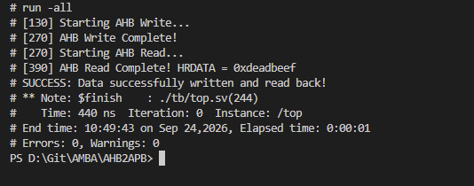
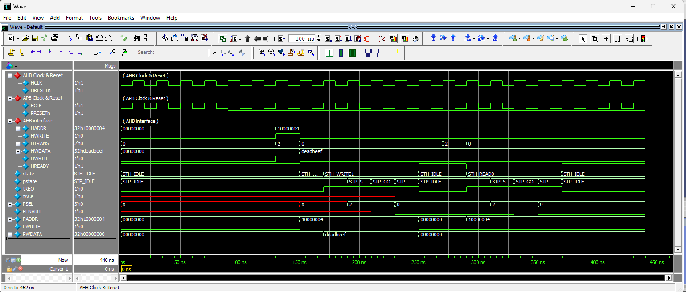

# AMBA AHB-to-APB Bridge & Memory Subsystem

## Overview

This project implements an **AMBA AHB-to-APB bridge and memory subsystem** in SystemVerilog. The design connects an AHB master to multiple APB slave devices and demonstrates protocol conversion, address decoding, peripheral access, and transaction verification.

The subsystem consists of an AHB-to-APB bridge, an APB address decoder, APB memory slaves, and a system-level verification testbench.

## Key Features

* **AHB-to-APB Protocol Conversion**
  FSM-based control logic converts AHB transactions into APB Setup and Access phases.

* **AHB Transaction Handling**
  Supports AHB read and write transactions using signals such as `HADDR`, `HWRITE`, `HTRANS`, `HWDATA`, and `HREADY`.

* **APB Address Decoding**
  Decodes the incoming address and generates the corresponding `PSEL` signal for multiple APB slaves.

* **APB Memory Slave**
  Implements a byte-addressable APB memory model with configurable response delay.

* **Wait-State Handling**
  Uses `PREADY` to model APB slave response latency and hold the AHB transaction until the APB transfer is completed.

* **System-Level Verification**
  Includes an AHB master testbench that performs write and read transactions and checks the returned data.

## Directory & File Structure

```text
.
├── ahb_to_apb_controller.sv   # AHB-to-APB bridge control FSM
├── apb_decoder_s3.sv          # APB address decoder
├── ahb_to_apb_s3.sv           # Top-level AHB-to-APB bridge
├── mem_apb.sv                 # APB memory slave
└── top.sv                     # System-level testbench
```

### Module Description

| Module                     | Description                                                     |
| -------------------------- | --------------------------------------------------------------- |
| `ahb_to_apb_controller.sv` | Controls the AHB-to-APB transaction flow using FSM-based logic. |
| `apb_decoder_s3.sv`        | Decodes the address and selects the corresponding APB slave.    |
| `ahb_to_apb_s3.sv`         | Integrates the bridge controller and APB decoder.               |
| `mem_apb.sv`               | Implements the APB memory slave.                                |
| `top.sv`                   | Provides system-level stimulus and transaction checking.        |

## Simulation & Verification

The testbench performs a complete read/write transaction through the AHB-to-APB subsystem.

### Test Sequence

#### 1. Initialization

The testbench generates the required clocks and resets the AHB and APB sides of the system.

#### 2. AHB Write Transaction

The AHB master writes:

```text
Address : 0x1000_0004
Data    : 0xDEAD_BEEF
```

The bridge converts the AHB write into an APB transaction and forwards it to the selected APB memory slave.

#### 3. AHB Read Transaction

The AHB master subsequently reads from the same address:

```text
Address : 0x1000_0004
```

The APB memory returns the previously stored data through the bridge.

#### 4. Data Verification

The testbench checks that:

```text
HRDATA == 0xDEAD_BEEF
```

A successful comparison confirms that the write and read data were transferred correctly through the AHB-to-APB subsystem.

## Waveform Debugging

The following signals are useful when debugging the design in ModelSim, QuestaSim, or another waveform viewer.

### AHB Interface

Monitor:

```text
HADDR
HTRANS
HWRITE
HWDATA
HRDATA
HREADY
HRESP
```

During an APB transfer, `HREADY` may be deasserted to stall the AHB transaction until the APB transfer completes.

### Bridge Control

Monitor the internal FSM state and handshake/control signals to observe the conversion from an AHB transaction to an APB transaction.

### APB Interface

Monitor:

```text
PADDR
PWDATA
PWRITE
PSEL
PENABLE
PREADY
PRDATA
PSLVERR
```

The APB transaction follows the standard:

```text
IDLE → SETUP → ACCESS
```

sequence.

During the **SETUP** phase, `PSEL` is asserted. During the **ACCESS** phase, `PENABLE` is asserted and the transfer completes when `PREADY` is asserted.

## Verification Result

The testbench verifies the complete transaction path:

```text
AHB Master
    │
    ▼
AHB-to-APB Bridge
    │
    ▼
APB Address Decoder
    │
    ▼
APB Memory Slave
```

The write/read test confirms correct data transfer across the complete subsystem.





AHB Master Request: The master initiates a write of data deadbeef (and later, a read to the same address). You can see HREADY drop low, successfully stalling the AHB bus while it waits for the APB-side transfer to complete.   

Bridge Handshaking: The internal synchronization is visible via tREQ and tACK. The AHB state machine (state) asserts tREQ and waits in STH_WRITE1 (or STH_READ0) until the APB side finishes the physical memory access and sends tACK back.   

APB 2-Cycle Protocol: The APB state machine (pstate) clearly demonstrates the standard AMBA APB timing. It transitions from STP_IDLE to STP_SETUP (asserting the PSEL chip select), and on the very next clock edge moves to STP_GO, which asserts the PENABLE strobe to finalize the data transfer.

## Tools

* SystemVerilog
* ModelSim / QuestaSim
* Verilator
* VS Code
* Git / GitHub

