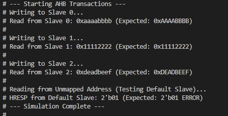
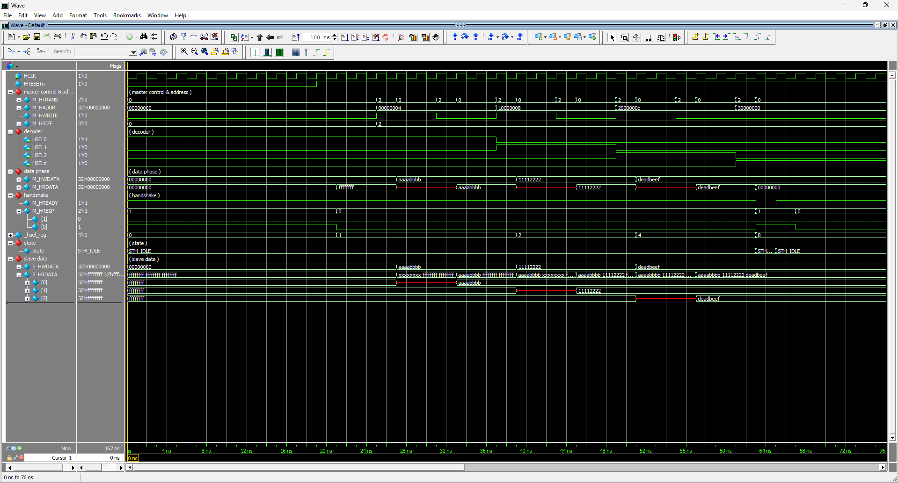

# AMBA AHB Design
## AMBA AHB and AHB-Lite
- AHB-Lite
  - Single-master and scale-down version of AHB
- AMBA AHB
  - Multi-master and full-scale version of AHB
## AMBA AHB-Lite
- AHB-Lite is a subnet of the full AHB specification, where only a single AHB master is used
  - A single master -> no master o slave multiplexor
  - No request/grant protocol to the arbiter -> No arbiter
  - No split/retry responses from slaves

## Testbench

- Successful Writes & Reads: The master executes three sequential write-and-read operations to three distinct memory slaves, which is shown by HSEL0, HSEL1, and HSEL2 asserting one after the other. The written payloads (aaaabbbb, 11112222, and deadbeef on M_HWDATA) are successfully returned on the M_HRDATA bus in the subsequent read cycles.   

- Error Handling: The final transaction attempts to read from an unmapped address (30000000). This correctly activates the default slave (HSELd), which drives an error response back to the master (visible when M_HRESP changes from 0 to 1). 
  
- AHB Pipelining: The waveform clearly demonstrates AHB's pipelined nature, as the address and control signals (like M_HADDR and M_HWRITE) are asserted one full clock cycle before the corresponding data phase (M_HWDATA or M_HRDATA) occurs.