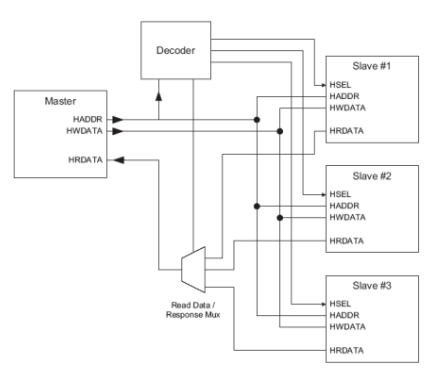
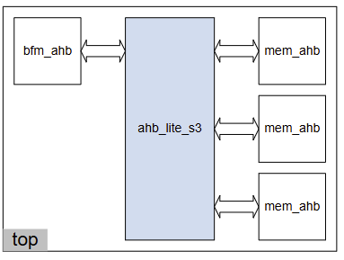

# AMBA AHB Design
## AMBA AHB and AHB-Lite
- AHB-Lite
  - Single-master and scale-down version of AHB
- AMBA AHB
  - Multi-master and full-scale version of AHB
## AMBA AHB-Lite
- AHB-Lite is a subnet of the full AHB specification, where only a single AHB master is used
  - A single master -> no master o slave multiplexor
  - No request/grant protocol to the arbiter -> No arbiter
  - No split/retry responses from slaves

