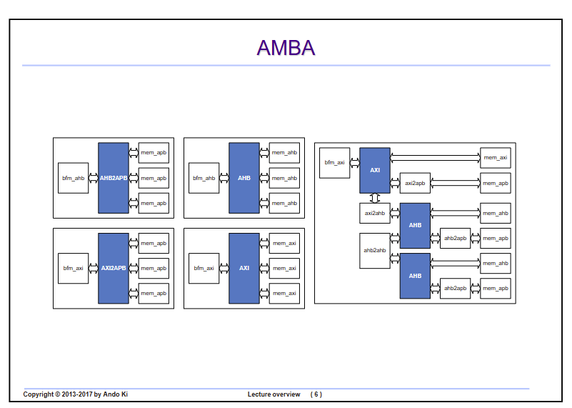
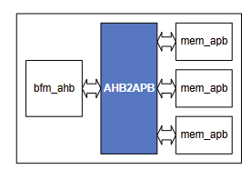
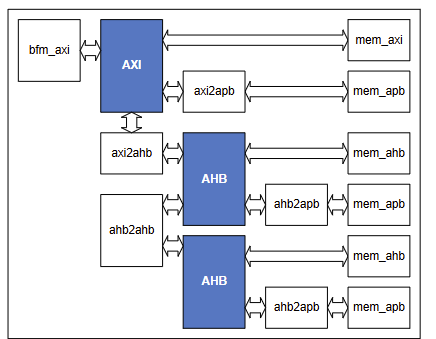
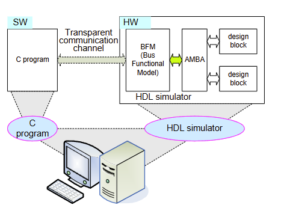
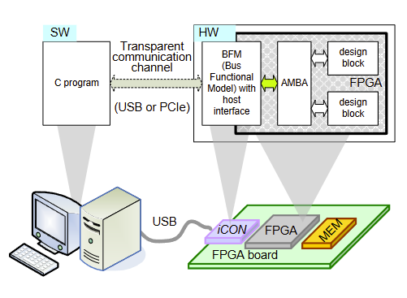

# AMBA AXI/AHB/APB bus and System

This is an overview of AMBA bus architectures and protocol bridges. The diagram is showing how different AMBA protocols can be connected to each other, mainly for verification and SoC interconnect design.

This is an AHB-to-APB bridge.

It demonstrates a mixed AMBA system, where AXI, AHB and APB coexist.

This diagram shows HW/SW co-simulation using a BFM (Bus Functional Model). The key idea is:
A C program acts like software, while the HDL simulator models the hardware. The BFM connects the software world to the AMBA bus inside the simulated hardware.

This architecture simplifies verification because developers can drive hardware tests using standard software commands, relying on the BFM to handle all the intricate protocol details instead of manually driving bus signals in a testbench.

