# What is bus
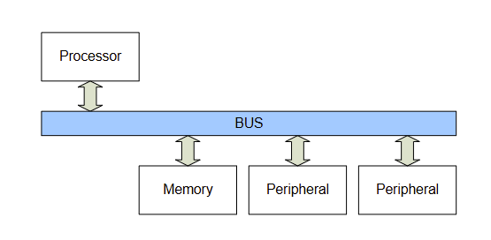
Bus means a set of commoon lines that electrically connects various blocks in order to transfer data among them.

# Bus arbitration
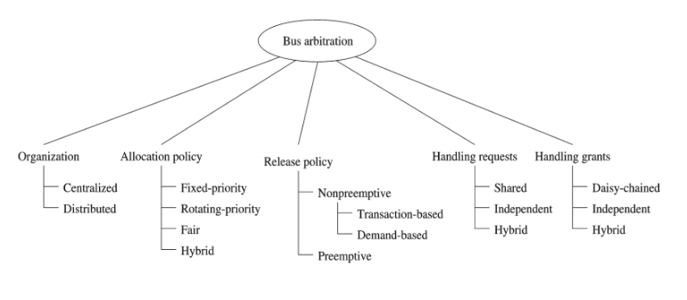

## Algorithm of arbitration
Fixed priority based
Round-robin

## Issues of arbitration
### Starvation
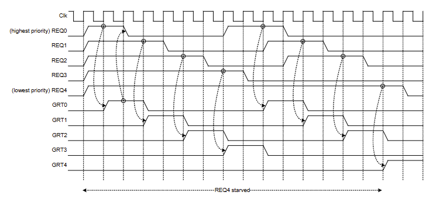

Starvation is a situation in bus arbitration where a block is unable to gain bus access and make progress for an extended period. As you can see REQ4 is starving, waiting for signal.
### Fairness
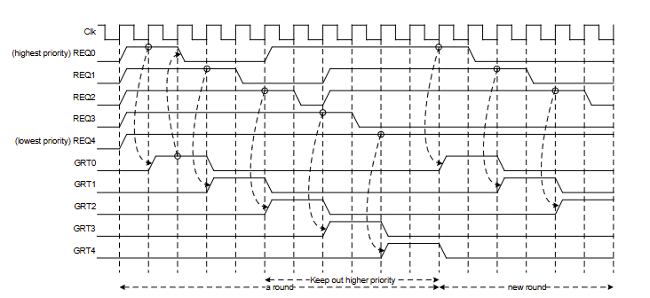

Fairness is an arbitration mechanism designed to prevent the starvation of lower-priority devices by grouping bus access into structured "rounds."

### Live-lock
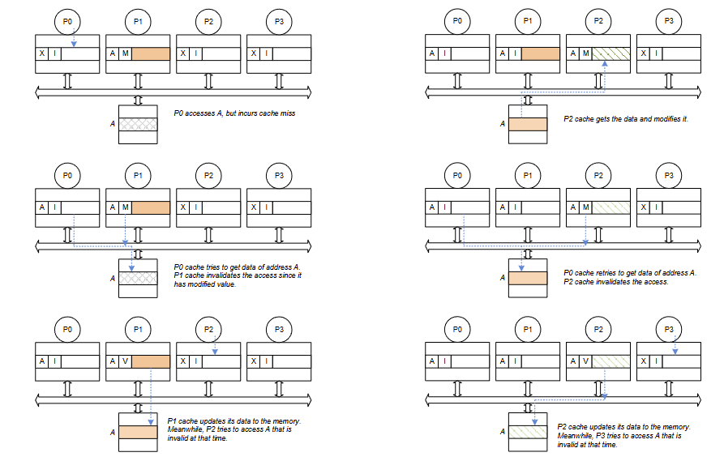

Live-lock is a condition where a hardware block is actively busy performing operations but is unable to make any actual progress. Unlike a dead-lock, a live-lock will eventually be resolved.

### Deadlock

Dead-lock is a situation in bus arbitration where a hardware block waits indefinitely for a condition that will never be resolved.

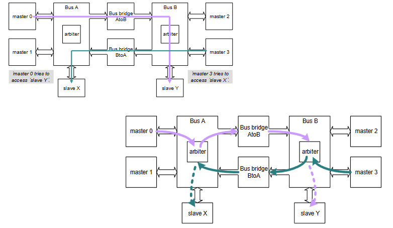

Master 0 cannot proceed to Slave Y because the arbiter on Bus B is currently locked by Master 3. Conversely, Master 3 cannot proceed to Slave X because the arbiter on Bus A is currently locked by Master 0.

Both masters (0 and 3) are stuck indefinitely, each holding the resource the other needs while waiting for the other to release its bus.

# Transfer types
## How to use bus more efficiently
Latency minimization
Throughput maximization
Speed vs bandwidth (= capability)

## How to capture access-intentions
It can be used to make bus efficient
DMA uses accesses that move a block of data.  
- *Need to support burst*

CPU generates two types of accesses and the tip about types will be used by cache
- *Instruction access: it never be modified by the CPU*
- *Data access: it may be altered by the CPU near future*

CPU with cache needs more types of transfers

# Burst transfers (1/3)
1. Master (CPU) sends A11 → this address goes out onto the address bus, to the slave.
2. Slave receives A11, and uses it to look up the location in its memory.
3. Slave finds the data at that location — that data is what we call D11.
4. Slave sends D11 back → this goes out on the data bus, back to the master.
5. Master receives D11 — transaction complete.
## Burst transfer in the bus is a means of data movement consisting of more than one transfer in order to get a higher throughput.

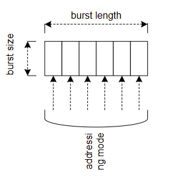

Burst length
- *num of beats in a burst*

Burst size
- *num of bytes moved in a single beat*

Addressing mode
- *incremental* (tăng dần): Each beat's address increases by the burst size from the previous one. Straightforward sequential access — e.g., address 0x00, 0x04, 0x08, 0x0C... for 4-byte beats.
- *wrapping* : The sequence would go: 0x0C → 0x00 → 0x04 → 0x08, then wrap back to 0x0C to complete.
- *fixed*: The address stays the same for every beat in the burst.
- *stride*: Each beat's address increments by a fixed "stride" value rather than by burst size

Other issues
- *partial burst size case, in which burst size is smaller than data bus width*

# Burst transfers (2/3)
## Burst (locked)
- *Address and data are locked together*

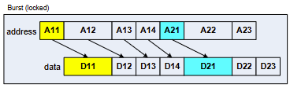

- *Single pipeline stage*
- *If on slave is very slow, all data is held up*

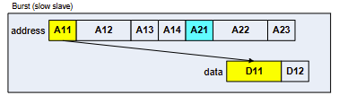
## One address for burst
- *One Address for entire burst*

  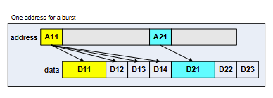

# Burst transfers (3/3)
## Multiple outstanding bursts
- *One Address for entire burst*
- *Allows multiple outstanding addresses*

  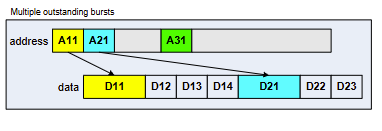

## Out-of-order completion
- *Masters can issue multiple orederd addresses*
- *Fast slaves may return data ahead of slow slaves*

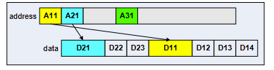

## Data interleaving
- *returned data can be interleaved* (dữ liệu trả về có thể được xen kẽ)

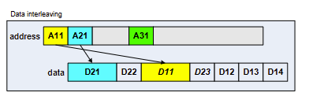

# Pipelined and split transfers
## Pipeline bus protocol
- *Arbitration, address, data phases can be overlapped*

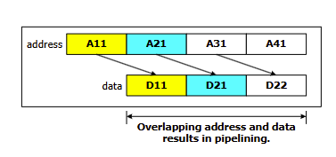

Pipelining means the address phase of the next transaction (A21) overlaps with the data phase of the current one (D11), so addresses keep flowing back-to-back with no gaps, unlike split transactions where a slow slave forces a retry.

## Split bus protocol
- *Split transfers improve the overall utilization of the bus by separating the operation of the master providing the address to a slave from the operation of the slave responding with the appropriate data.*

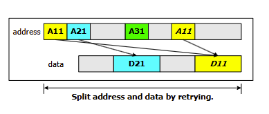

A11's address is sent first, but since its data (D11) isn't ready yet, the bus moves on to A21 and A31, and A11 has to be retried later to finally get its data back — so the address and data phases end up split apart in time, with other transactions filling the gap.

# justified or non-justified
## Justified bus
Byte always travels on tightmost or leftmost quarter of bus
- *Size determines the lanes that data actually use*
- *Wishbone bus*

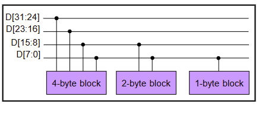

## Non-justified bus / unjustified bus
Bus lanes are extension of memory bank lane
- *address determines the lanes that data actually use*
- *AMBA bus*

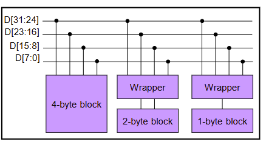

# Partial/ narrow access
## How to read/ write two-byte through 32-bit data bus?
For read, read full width and ignore some.
For write, need something to indicate which bytes are important

## Partial access is used to read/write a fewr number of bytes than the data bus width.

Byte enable
- *Enable signals are given to indicate which byte are active*
- DATA[31:0] with BE[3:0]
  
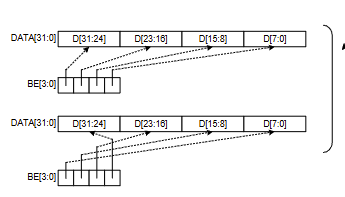

Size and address
- *Size and a lower bits of address determines active bytes*
- *DATA[31:0] with SIZE[1:0] and ADDR[1:0]*

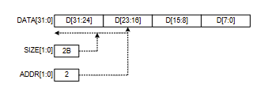

# Atomic operations

Only one can enter the critical section at a given time and any other cannor enter the region until the first one unlock it.

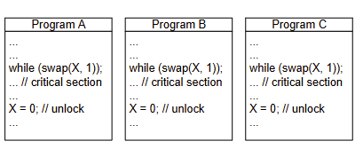

If X was 0 (unlocked) before the swap: swap returns 0 (the old value), so while(0) is false → the loop exits, and the program enters the critical section. Meanwhile, X has now been set to 1, locking it for everyone else.

If X was already 1 (locked) before the swap: swap returns 1, so while(1) is true → the loop keeps spinning, repeatedly trying swap until it eventually reads a 0. This is called a spinlock.

When the program is done with the critical section, it sets X = 0, unlocking it — letting one of the waiting programs finally succeed on its next swap attempt.

# CDC problems
## Data can be lost with fast-to-slow clock

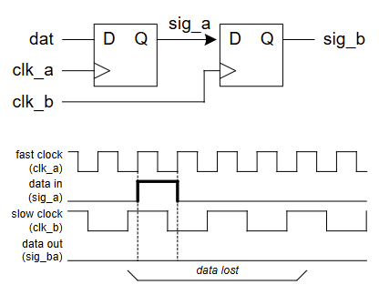

## Solutions
- *Edge detection*
- *Feedback or handshake*

