# On-Chip Bus for SoC


# What is on-chip bus
## Bus
Bus means a set of common lines that electrically (or optically) connects various units (circuits) in order to transfer the data among them
- Protocol (communication protocol) is a set of rules to accomplish data transfer among units along the bus.
- OCB (On-Chip Bus) is an interconnection mechanism residing within a SoC and used to interconnect design blocks (i.e., IP) in the SoC

# On-Chip Bus Evolution

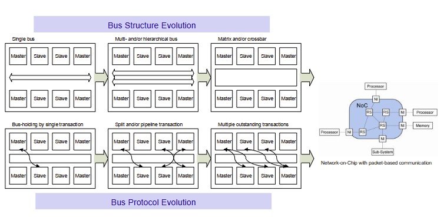

## Bus structure Evolution
Single bus -> Multi and/or hierarchical bus -> Matrix and/or crossbar

## Bus Protocol Evolution
Bus-holding by single transaction -> Split and/or pipeline transaction -> Multiple outstanding transactions

---
# AMBA bus
## AMBA (Advanced Microcontroller Bus Architecture) AHB
- Open standard on-chip bus
- Single clock-edge operation
- Non-tristate bus
- Non-justified data lane
## AMBA buses
- AXI4: AXI (in 2009)
- AXI: Advanced eXtensible Interface (in 2003)
- AHB: Advanced High-performance Bus (in 1999)
- ASB: Advanced System Bus (in 1995)
- APB: Advanced Peripheral Bus (in 1995)
## Other specs
- ACE, ATB
---
# AHB 
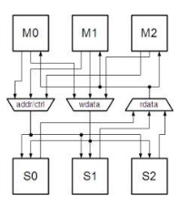

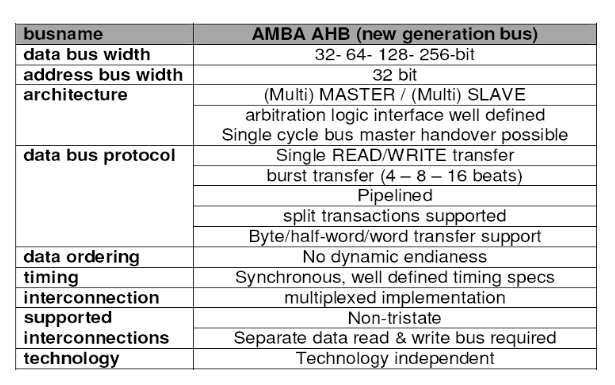

- data bus width 32 - 64 - 128 - 256 bits
- address bus width 32 bits
## High-performance synthesizable designs
- High-bandwidth operation
- High clock frequency systems

## Features

- multiple bus masters
- Burst transfers (4 - 8 -16 beats)
- Split transactions
- Single-cycle bus master handover
- Single-clock edge operation
- Non-tristate implemmentation
- Wider data bus configurations (64/128bits)
---
# APB 

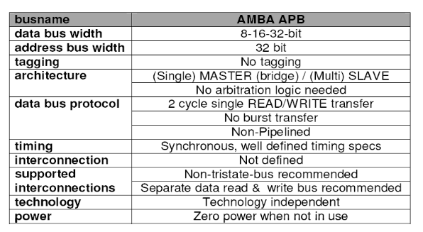

- data bus width 8 - 16 - 32 bits
- address bus width 32 bits
## Low-power extension to the system bus (AHB/ASB)
- Minimal power consumption
- Reduced interface complexity

## local secondary bus that is encapsulated as a single AHB/ASB slave device
- A slave module which handles local peripheral bus
- An APB bridge converts AHB or ASB transfers into a suitable format for the salve devices on the APB
- The bridge provides latching of all address, data and control signals

## Features
- Low bandwidth
- Unpipelined bus interface 

    *address and control valid throughout the access (unpipelined)*

- All signal transitions are only related to the rising edge of the clock
- Zero-power interface during non-peripheral bus activity (peripheral bus is static when not in use)
- Timing can be provided by decode with strobe timing (unclocked interface)
- Write data valid for the whole access
  
  *Allowing glitch-free transparent latch implementations*c

---

# **CoreConnect**

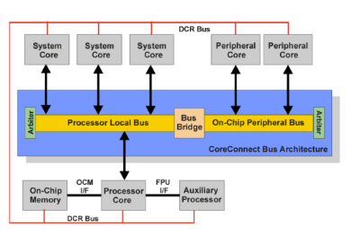

```
CoreConnect is a complete and versatile solution, as it is well thought trough and has a good architecture. It clearly targets high performance systems, thus raising the complexity and offering many features that might be overkill in simple embedded applications
```

## PLB (Processor Local Bus)
- High performance 32/64 bits on-chip bus used in highly integrated Core+ASIC systems
  + High bandwidth capabilites
  + Pipelining
  + Multiple masters
  + 32 64 128 bit architecture
  + Split transactions
  + Cache Line transfers
  + Overlapped arbitration 
## OPB (On-chip Peripheral Bus)
- For easy connection of on-chip peripheral (Ngoai vi) devices
  + Connect to lower speed peripherals
  + Low power consumption
  + Supports single-cycle data transfers
  + Multiple masters
## DCR (Device control register)
- To transfer data between the CPU's general purpose registers (GPRs) and the DCR salve logic's device control registers (DCRs)
  + Movement of GPR data between CPU and slave logic
  + Reduces loading and improves bandwidth of the PLB

---
# PLB (Processor Local Bus)

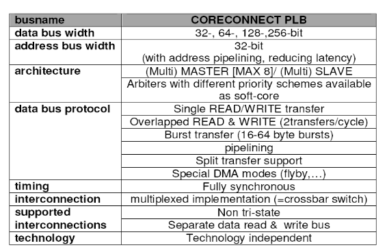

## PLB Interconnect

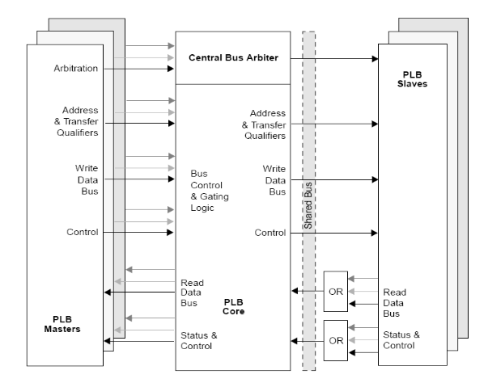

1. **To address** the high performance and design flexibility needs of highly integrated Core + ASIC systems.
2. High performance features 
   - Overlapping of read and write transfers allows two data transfers per clock cycle
   - Decoupled address and data buses support split-bus transaction capability
   - Address pipelining
   - Late master request abort capability reduces latency associated with aborted requests
   - Hidden (overlapped) bus request/grant protocol reduces arbitration latency (độ trễ trọng tai)
   - Fully synchronous bus.
3. System Design Flexibility
   - Sixteen masters and any number of salve devices
   - Four levels of request priority for various arbitration schemes
   - Bus arbitration-locking mechanism allows for master-driven atomic operations.
   - Byte-enable capability
   - Support for 16 32 64 byte line data transfers
   - Read word address capability (that is, target word-first or sequential)
   - Byte, half word, and word burst data transfers in either direction.
   - Guarded and unguarded memory transfers allow the prefetching of instructions or data.
   - DMA buffered, flyby, peripheral to memory, memory to peripheral, and DMA memory to memory operations are supported.

# OPB

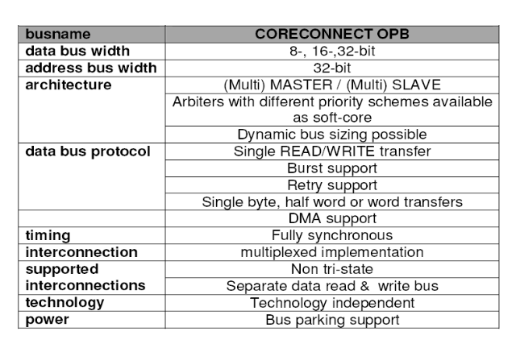

## OPB Implementation

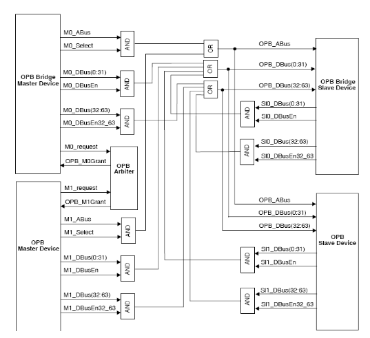

1. For **easy connection** of on-chip **peripheral devices**
2. It is not intended to connect directly to the processor core
   - The processor core can access the slave peripherals on this bus through the PLB to OPB bridge unit
3. Features
   - Up to a 64-bit address bus / 32-bit or 64-bit data bus implementations
   - Fully synchronous
   - Provides support for 8-bit, 16-bit, 32-bit, and 64-bit slaves / 32-bit and 64-bit masters
   - Dynamic bus sizing; byte, halfword, fullword, and doubleword transfers
   - Optional Byte Enable support
   - Uses a distributed multiplexer method
   - Byte and halfword duplication for byte and halfword transfers
   - Single cycle transfer of data between OPB bus master and OPB slaves
   - Sequential address protocol support
   - A 16-cycle fixed bus timeout provided by the OPB arbiter
     + OPB slave is capbale of disabling the fixed timeout counter to suspend bus timeout error
   - Support for multiple OPB bus masters
   - Bus parking for reduced latency
   - OPB masters may lock the OPB bus arbitration
   - OPB slaves capable of requesting retry to break possible arbitration deadlock
   - Bus arbitration overlapped with last cycle of bus transfers 


# DCR Bus

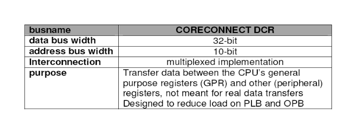

## Connection

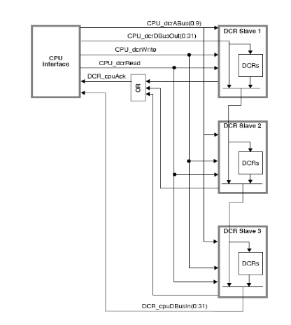

1. **To transfer data** between the CPU's general purpose registers (GPRs) and the DCR slave logic's device control registers (RCRs)
2. To remove configuration registers from the memory address map.
   - To reduces loading
   - To improves bandwidth of the processor local bus.
3. Fully synchronous
   - The slower clock's rising edge always corresponds to the faster clock's rising edge
4. The DCR bus is typically implemented as a distributed mux
   - Each sub-unit not only has a path to place its own DCRs on the CPU's DCR read path
   - but also has a path which bypasses its DCRs and places another unit's DCRs on the CPU's DCR read path.
5. The DCRs are on-chip registers that exist architechturally outside the processor core
   - Move to device control register (mtdcr) instruction
   - Move from device control register (mfdcr) instructions
6. Features
   - 10-bit address bus and 32-bit data bus
   - 2-cycle minimum read or write transfers extendable by slave or master
   - Handshake suppots clocked asynchronous transfers
   - Slaves may be clocked either faster or slower than master
   - Single device control register bus master
   - Distributed multiplexer architechture
   - A simple but flexible interface

# Avalon
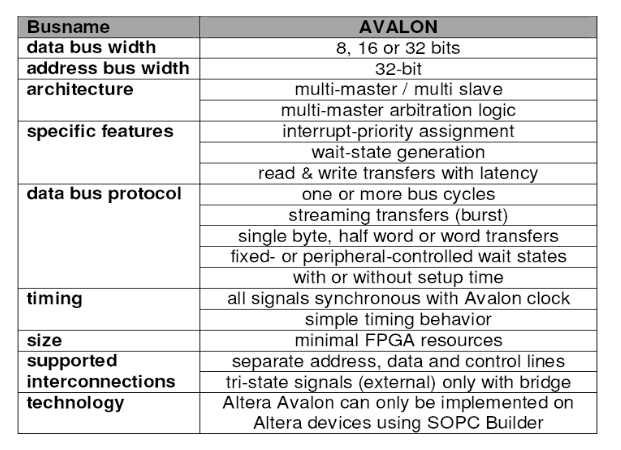

## Avalon Interconnection
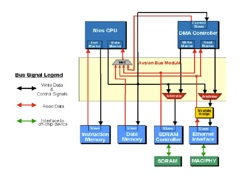

1. **To acommodate peripheral development (Để hỗ trợ sự phát triển ngoại vi)** for the system-on-a-programmable-chip (SOPC) environment
2. Altera's parameterized interface bus used by the Nios embedded processor
3. Features
   - Separate Address, Data and Control Lines
       + Provides the simplest interface to on-chip logic
       + Using dedicated address and data paths
   - Up to 128-bit Data Width
   - Synchronous Operation
   - Dynamic Bus Sizing
       + Handles the details of transferring data between peripherals with different data widths
       + Avalon peripherals with differing data widths can interface easily with no special design considerations.
   - Simplicity
   - Low resource utilization
   - High performance
       + Up to one-transfer-per-clock
4. Avalon switch fabric has a set of pre-defined signal types with which a user can connect one or more intellectual property (IP) blocks.
5. The wizard-based Altera's SOPC Builder system development tool automatically generates the Avalon switch fabric logic
6. The generated switch fabric logic includes
   - Chipselect signals for data-path multiplexing
   - address decoding
   - wait-state generation
   - interrupt-priority assignment
   - dynamic bus sizing
   - multi-master arbitration logic
   - advanced switch fabric transfers
7. Avalon masters and slaves interact with each other based on slave-side arbitration
         
# Wishbone
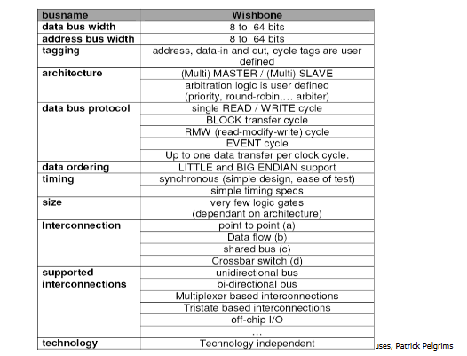

1. Simple, compact, logical IP core hardware interfaces
2. Variable core interconnection methods
   - point-to-point
   - Shared bus
   - Crossbar switch
   - Data flow interconnection
   - Switched fabric interconnections
   - Off chip
3. User-defined tags
   - Applying information to an address bus, a data bus or a bus cycle
   - Helpful when modifying a bus cycle to identify information such as:
        + Data transfers
        + Parity or error correction bits
        + Interrupt vectors
        + Cache control operations
   - Multi-MASTER
   - Arbitration methodology is defined by the end user
4. Point-to-point interconnection
   
   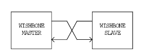
5. Data flow interconnection
   
   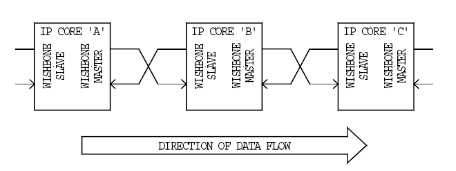
6. Shared bus interconnection
   
   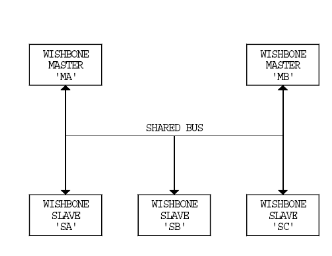
7. Crossbar switch interconnection
   
   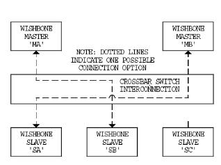
## Standard connection
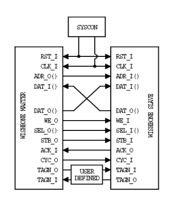

## Single transfers
1. Single read
   
   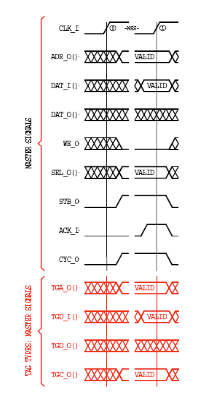

2. Single write
   
   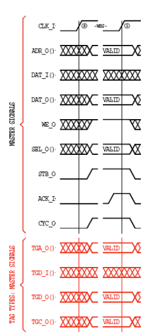

## Block transfer
1. Block read
   
    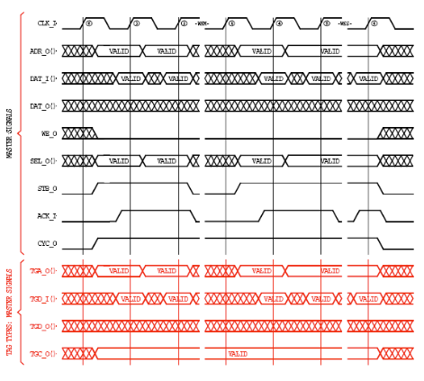

2. Block write
   
   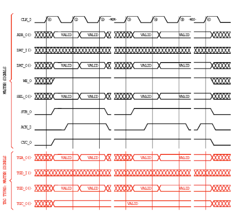

## RMW Cycle

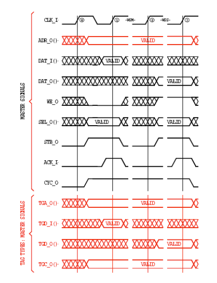