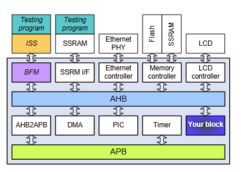
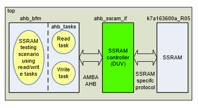

# BFM-Based Verification Methods
## What is BFM
BFM: Bus Functional Model, Bus Functional Module
BIM: Bus Interface Module
BFM: is a functional model generates bus transaction
BFM descrives the behavior of the part at the interface-level without modeling the internal operation of the part
- A sort of transactor (Một loại giao dịch)

## Usages of BFM
Task-based BFM
File-driven BFM
Native-code driven BFM
Embedded ISS-driven BFM
Remote ISS-driven BFM

## Task-based BFM example
'task' is a language construct of Verilog, which is a kind of sub-routing can contain time-controlling statements.
- Note that 'function' is a similar with 'task' but it should execute in zero simutalion time.
A relatively complex testing scenario can be build by combining tasks
BFM code shoulb be re-written when tsting scenario changes.

