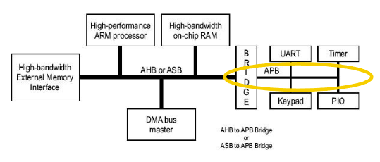
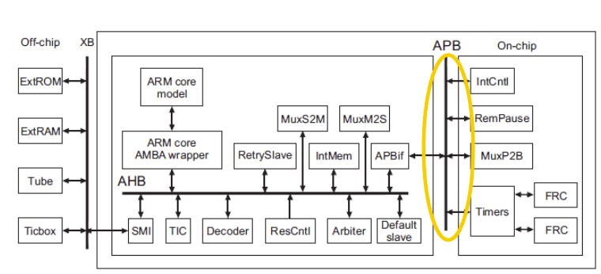

# APB (Advanced Peripheral Bus)

- *AHB: Advanced high-performance bus*
- *ASB: Advanced System Bus*
- *APB: Advanced Peripheral Bus*
- *FRC: Free-running counter*

##  APB

Low-power extension to the system bus (AHB/ASB)
- Minimal power consumption
- Reduced interface complexity
Local secondary bus that is encapsulated as a single AXI/AHB slave device
Features
- Low bandwidth
- Unpiplined bus interface
    + address and control valid throughout the access -> unpipelined
- All signal transitions are only related to the rising edge of the clock -> Synchronous

