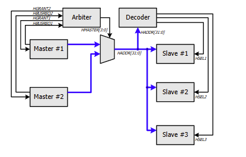
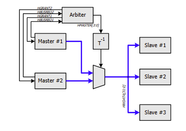
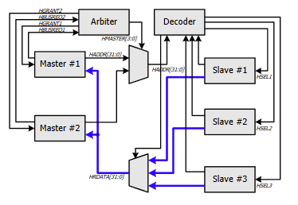
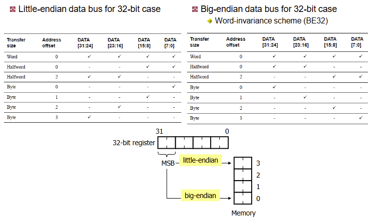

# Introduction to AMBA AHB
## AMBA 2 naming convention
- ALL AMBA bus signals are named such that the first letter of the name indicates which bus the signal is associated with.
  + H: AHB
  + P: APB
  + B: ASB
## AMBA AHB components
- Master
  - Initiate read and wrote operations by providing an address and control information
- Slave 
  - Responds to a read or write operation within a given address space range.
- Arbiter
  - Ensures that only one bus master at a time is allowed to initiate data transfers
- Decoder
  - Decode the address of each transfer and provide a select signal for the slave that is involved in the transfer
## AMBA address path
 

## AMBA data path (write)

## AMBA data path (read)

## Why slave should check HREADY
- Slave Y needs to know when Slave X ends its transfer, by watching 'HREADY'
  - When 'HREADY' is 1, Slave Y knows Slave X completes its transfer.

## Burst Operation
- 1,4,8 and 16-beat bursts are defined in AMBA AHB
  - Beat means a signle cycle of data transfer
  - Note that bust size does not indicates the number of bytes
- Burst must not cross a 1Kbyte address boundary
  - The minimum address space that can be allocated to a signle slave is 1kB.

## Four-beat incrementing burst
- 4-beat incremental HBURST = 3'b011 with word size HSIZE = 3'b010 starting from A
  - A, A+4, A+8, A+12
- 4-beat incremental (HBURST=3'b011) with byte size HSIZE = 3'b000 starting from A
  - A, A+1, A+2, A+3

## Multi-byte endianness

