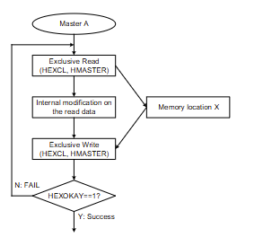
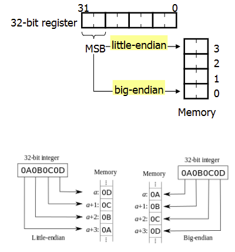

# Introduction to AMBA 5 AHB5
## AHB5 new properties
- Extended_Memory_Types
  - HPROT[6:4]
- Secure_Transfers
  - HNONSEC
- Endian
  - Little & Big endian
- Stable_Between_Clock
  - Glitch free between consecutive two rising edge of HCLK
- Exclusive_Transfers
  - HEXCL, HEXOKAY
- Multi_Copy_Atomicity
  - The single-copy atomicity size defines the number of data bytes that a transfer is guaranteed to update atomically
    - 32-bit data
  - Lulti_Copy_AtomicityL Writes to the smae location are observed in the same order by all agents
  - Related to cache coherency

## Exclusive Transfer
  - This sequence ensures that the memory location is only updated if, at the point of the store to memory, the location still holds the same value that was used to calculate the new value to be written to the location
  
  
  - If The Exclusive Write transfer fails, it is expected that the master will repeat the entire Exclusive access sequence
  -  Exclusive access monitor
     -  It monitors which master is performing exclusive transfer

## Exclusive signals
  - HEXOKAY must only be seerted in the same cycle as HREADY is asserted
  - HEXOKAY must not be asserted in the same cycle as HRESP is asserted
    - HEXOKAY should not be driven when ERROR (HRESP is 1)

## Edianness
- Little- endian and big-endian

- AMBA AHB usually uses little-endian.
- AHB5 also allows big-endian in two forms.
  - BE8: Byte-invariant big-endian
  - BE32: Word-invariant big-endian

