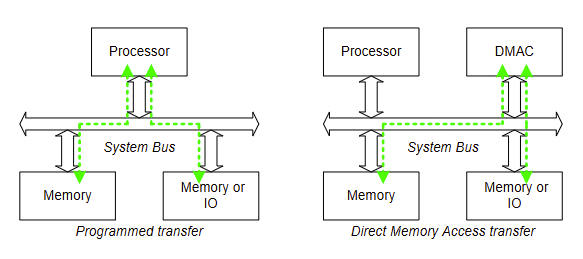
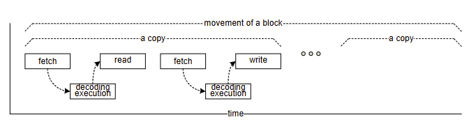
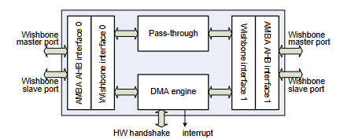
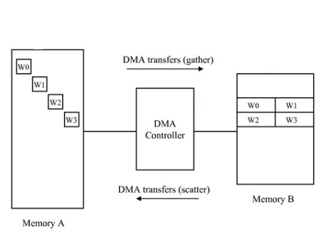

# Introduction to DMA
## Data transfer

## Transferring a block of memory
- Copying or moving a block of memory contents takes time since the processor needs to do followings
  - fetch instructions
  - decode/execute the instructions
  - read memories or registers
  - write memories or registers
- Potential problems
  - The processor wastes time to copy/move a block of memory
    - -> performance degradation
  - the processor cannot do burst transfer
    - -> low efficiency

## What is DMA and DMAC
- A direct memory access (DMA) is an operation in which data is copied (transported) from one resource to another resource in a computer system without the involvement of the processor
- The task of a DMA-controller (DMAC) is to execute to the copy operations of data from one resource location to another
  - The copy of data can be performed from:
    - I/O-device to memory
    - memory to I/O-device
    - memory to memory
    - I/O-device to I/O-device

## Features DMAC needs to support
- Registers to hold DMA information
  - source address
  - destination address
  - length of block to move
  - and other
- Notification of completion
  - flag setting for poling and/or
  - interrupt
- Burst transfer in order to get a better performance
- Minimize interference to the system operation
- Do not occupy system resource for a long time
  - Burst-based arbitration
    - do not hold system bus for a whole DMA operation
- Multiple DMA with resonable scheduling
  - Multi-channel DMA
- Load balance among DMA channels
  - Fairness among DMA channels, e.g., chunk based round-robin
    - chunk is a series of bursts
- Scatter-gather operation
  - Source/destination may not be continuous space
    - Due to virtual address paging mechanism
## Opencores DMAC
- Wishbone DMA/Bridge Ip Core

## Scatter-gather
- Scatter-Gather DMA is data transfers from one non-contiguous block of memory to another by means of a series of smaller contiguous-block transfers

