# Introduction to AMBA AXI
## AXI terminologies
- Channel
  - Independent collection of AXI signals associated to a VALID signal
- Interface
  - Collection of one or more channels that expose an IP core's function, connecting a master to a slave (Each IP core may have multiple interfaces)
- Bus
  - Multiple-bit signal (not an interface or channel)
- Transfer
  - A single exchange of information. That is, with one xVALID/xREADY handshake
- Transaction
  - An entire burst of transfers, comprising an address, one or more data transfers and a response transfer (writes only)
    - A write "transaction" including an AW "transfer", one or more W "transfers" and finally a B "transfer"
    - A read "transaction" starts with an AR "transfer" and is followed by one or more "R" transfers
- Burst
  - Transaction that consists of more than one data transfers
## AXI architecture
- AXI protocol
  - Channel-based protocol
    - 5 independent channels
    - 32-bit addr/data: 184~204 wires
  - Single-clock edge operation: ACLK
  - Two-way flow-control mechanism for each channel
    - Valid/ready handshake mechanism
  - Separate address/control and data phases
  - Burst-based protocol
  - One address for burst
  - Varuable-length burst
    - 1 to 16 data transfers per burst
  - Multiple outstanding bursts
  - Out-of-order transaction completion
  - Data interleaving

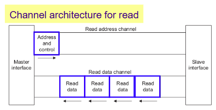

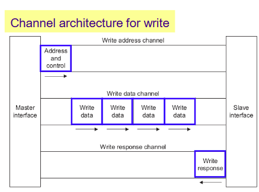

## VALID/READY handshake mechanism (1/2)
- Basic AXI handshaking
  - Master asserts and holds 'VALID' when data is available
  - Slave asserts 'READY' if able to accept data
  - 'DATA' and other signals transferred when 'VALID' and 'READY' are 1.

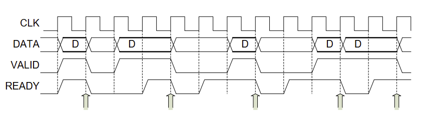

## VALID/READY handshake mechanism (2/2)
- Protocol (basic AXI handshaking)
  - The transmitter asserts VALID on any clock cycle when it has data and de-asserts when it does not
  - The receiver asserts READY on any cycle when it is ready for data and de-asserts when it is not
  - In any clock cycle in which VALID and READY are both asserted, data "moves", meaning it is taken by the receiver.
  - 'Ready before Valid' handshake is better than others in terms of data transfer latency
    - 'Valid before Ready' handshake requires at lease two cycles
  - Deadlock avoidance scheme is required
- Two-way flow-control
  - Both master and slave can control the rate of information movement.
- Dueal-ready handshake: two-way VALID/READY handshake
  - A LAST signal to indicate when the transfer of the final data item within a transaction takes place
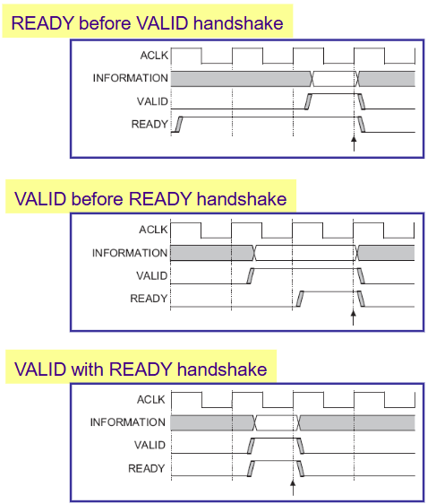

## Channel-based burst protocol of AXI

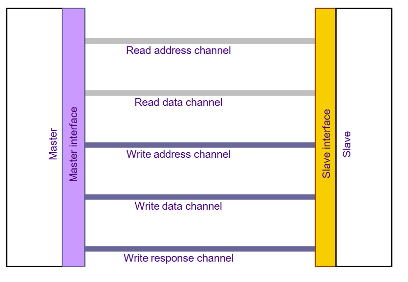

## Five independent channels
- Each channel uses two-way valid/ready handshake mechanism
- Each channel transfers information on only one direction

    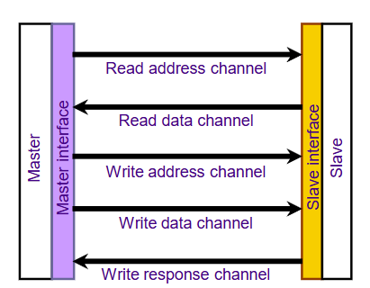

- Read address channel
  - Carrying address and control information from master to slace
  - 'AR' prefix
- Read data channel
  - Conveying read data and read response onformation from slave to master
  - 'R' prefix
- Write address channel
  - Carrying address and control information from master to slave
  - 'AW' prefix
- Write data channel
  - Conveying write data from master to slave
  - Treated as buffered
  - 'W' prefix
- Write response channel
  - Providing write response from slave to master
  - 'B' prefix

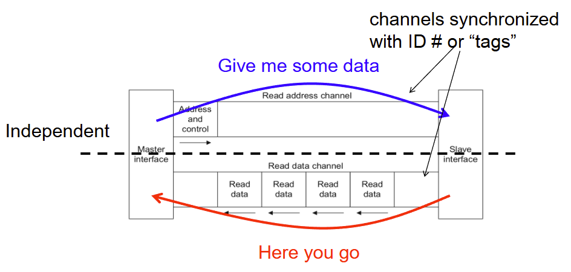

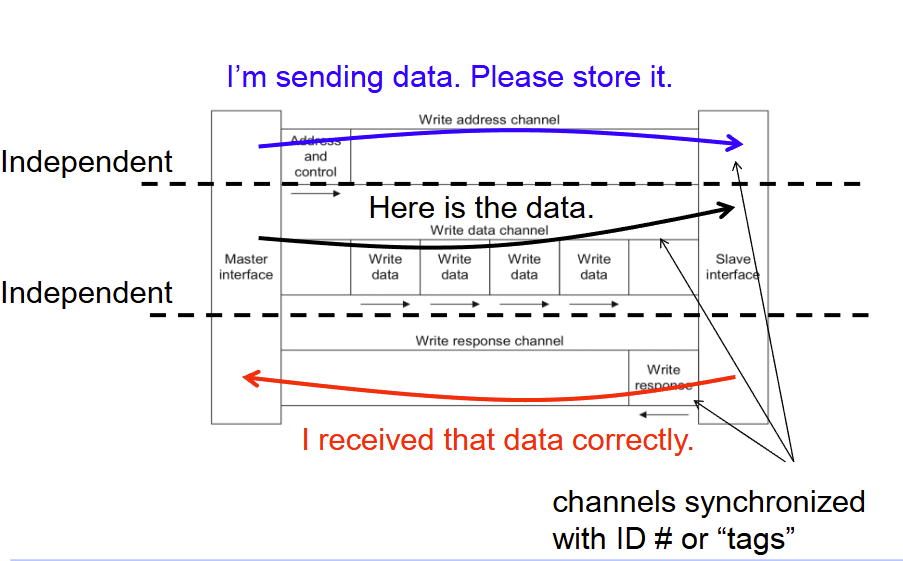

## AMBA AXI Flow-Control
- Information moves only when:
  - Source is Valid
  - Destination is Ready
- Oneach channel the master or slave can limit the flow
- Very flexible
- Thre is a potential problem **DEADLOCK**
- On a write transaction the master must not wait for AWREADY before asserting WVALID
  
## Read burst example

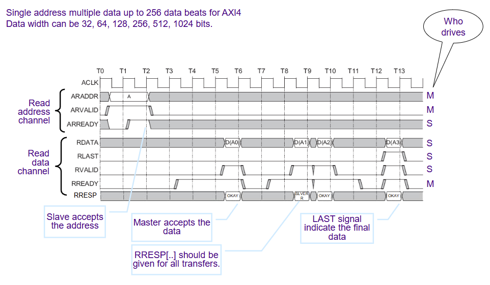

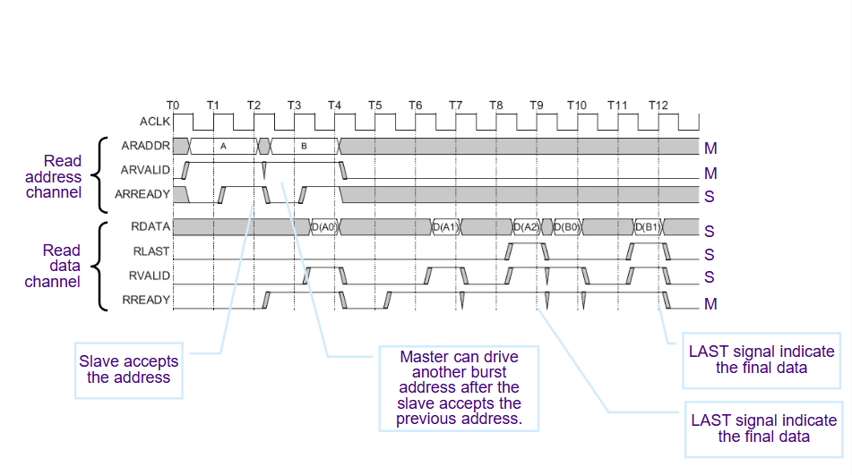

## Write burst example

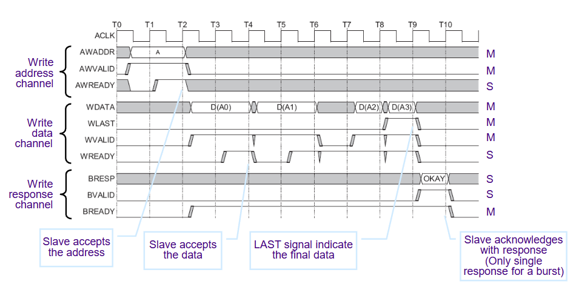

## Signals

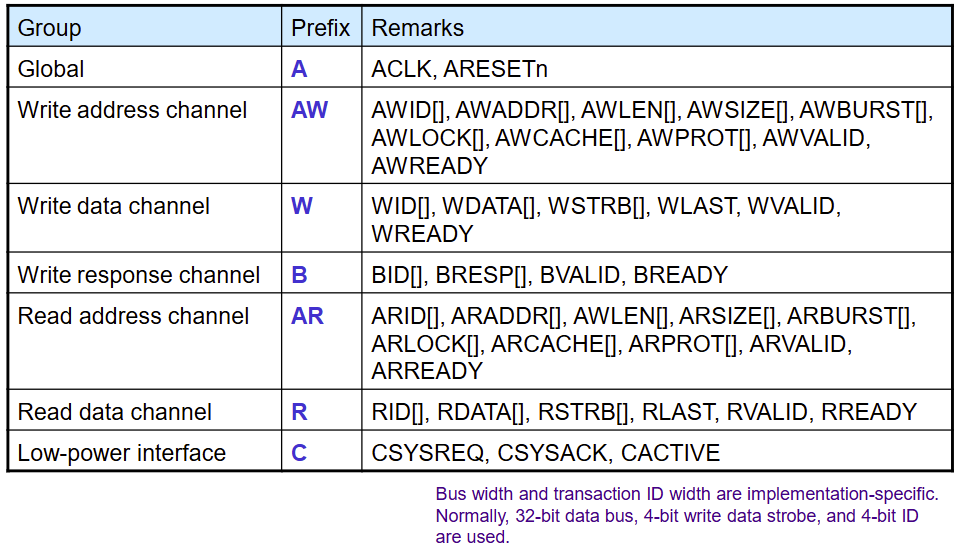

## Global signals
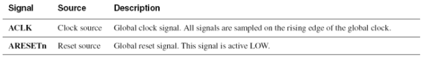

- Each AXI component uses a single clock signal: ACLK
- All input signals are sampled on the rising edge of ACLK
- All output signal changes must occur after the rising edge of ACLK
- No combinational path between input and output is allowed 
- The reset signals, ARESETn, can be asserted asynchronously
- The reset signal, ARESETn, must be de-asserted after the rising edge of ACLK
- Durng ARESETn is low
  - All valid signals must be low: ARVALID, AWVALID, WVALID, RVALID, BVALID.
- All valid can be driven high only a rising ACLK edge after ARESETn is high

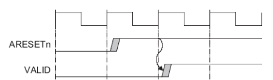

## AMBA AXI4-Lite
- AXI-Lite key feature
  - burst length 1 only
  - no partial data access, all data access are the same size as the width of data bus
  - 32-bit (or 64-bit) data bus only
  - all accesses are 'device non-bufferable'
  - exclusive access not supported
  - no AXI ID, all transactions must be in order -> all access use a single fixed ID value

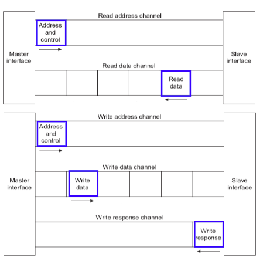

- Required signals

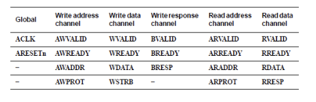

