# AMBA AXI
## Addressing options
- Burst must not cross 4KB boundaries to prevent them from crossing boundaries between slaves and to limit the size of the address incrementer required within slaves
  - note that AHB requires 1Kbyte boundary
- Rules for wrapping burst
  - The start address must be aligned to the size of the transfer
  - the length of the burst must be 2,4,8 or 16
## Data bus option
- The write strobe signals, WSTRB, enable sparse data transfer on the write data bus. Each write trobe signal corresponds to one bye of the write data bus. When asserted, a write strobe indicates that the corresponding byte lane of the data bus contains valid information to be updated in memory.
- Ther is one write strobe for each eight bits of the write data bus, so WSTRB[n] corresponds to WDATA[(8xn)+ 7:(8xn)]. n = 1 -> WDATA[15:8]

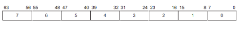

- The AXI protocol enables a master to use the low-order address lines to signal an unaligned start address for a burst
  - The information on the low-order address lines must be consistent with the information contained on the byte lane strobes
## Narrow transfer
- When a master generates a transfer that is narrower than its data bus, the address and control information determine which byte lanes the transfer uses. In the incrementing or wrappong bursts, different byte lanes transfer the data on each beat of the burst. In a fixed burst, the address remains constant, and the byte lanes that can be used also remain constant.
- Example
  - The burst has five transfers
  - the starting address is 0
  - each transfer is eight bits
  - the transfers are on a 32-bit bus.

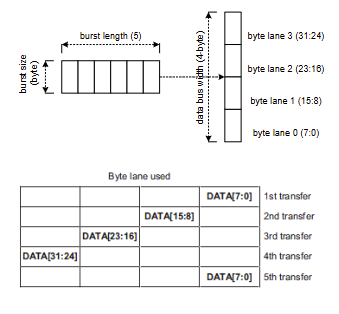

## Endianness and endian mapping
- Little-endian vs Big-endian

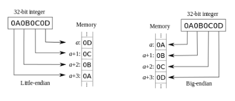

- Little/Big/Middle-endian

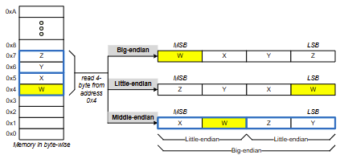

- Address invariance (byte invariance)
  - the address of bytes is always preserved between big and little
    - The byte address is constant but byte significance is reversed when little- & big- endian are mixed
- Data invariance
  - The relative byte significance is preserved for data of a particular size
## Invariance
- Address invariance (byte invariance)
  - When 4-byte data is read by big- or little- endian fashion
    - The 4-byte are stored at the same address (invariant), but its significance varies depending on access size.
- Data invariance
  - 32-bit data invariance (word invariance)
    - The data of 32-bit word always the same value independent of endianness
  - 16-bit data invariance (half-word invariance)
    - The data of 16-bit word always the same value independent of endianness
  - This scheme makes it possible to inter-mix big- and little-endian system without any treatment
    - Howerver, accesses should keep its access size
      - 32-bit data invariance only guarantees data-invariance for 32-bit wide data access

## Byte invariance (Address invariance)
- Byte-invariant endianness means that a byte transfer to a given address passes the eight bits of data on the same data bus wires to the same address location
  - AXI uses nonjustified-bus with little-endian
  - Most little-endian components can connect directly to a byte-invariant interface.
  - Components that support only big-endian transfers require a conversion function for byte-invariant operation.
    - The conversion function should provide byte-invariant

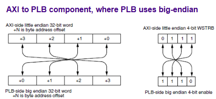

## Unaligned transfers
- The AXI protocol uses burst-based addressing, which means that each transaction consists of a number of data transfers. Typically, each data transfer is aligned to the size of the transfer
  - For example, a 32-bit wide transfer is usually aligned t four-byte boundaries. However, there are times when it is desirable to begin a burst at an unaligned address
- The AXI protocol enables a master to use the low-order address lines to signal an unaligned start address for a burst. The information on the low-order address lines must be consistent with the information contained on the byte lane strobes
- Aligned and un-aligned word (4-byte) transfer on a 64-bit bus.
  - (note shaded byte-lane is not used)

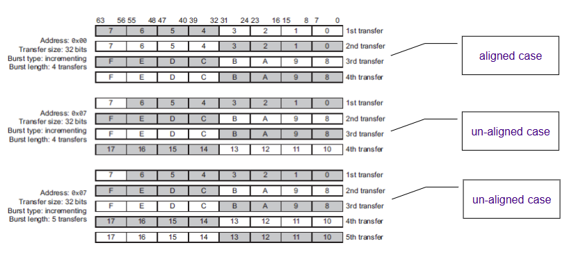

## Wrapping burst
- Rules for wrapping burst
  - Bursts must not cross 4KB boundaries
  - the start address must be aligned to the size of the transfer
  - the length of the burst must be 2,4,8 or 16
- (beat size) can be equal to or smaller than data bus width
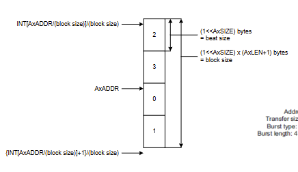

- Aligned wrapping word (4-byte) transfers on a 64-bit bus
  - (note shaded byte lane is not used)
  - AxADDR = 0x...4
  - AxSIZE = 3'b010 (4-byte)
  - AxLEN = 4'b011 (4 beats)
  - AxBURST = 2'b10 (wrapping)

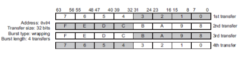

## Responses
- BRESP [1:0] for write response of write transaction
  - a single response is signaled for the entire burst, and not for each data transfer within the burst
- RRESP [1:0] for read data of read transaction
  - Each transfer has its own response
- The OKAY response indicates:
  - The success of a normal access
  - The failure of an exclusive access
  - An exclusive access to a slave that does not support exclusive access
- The EXOKAY response indicates the success of an exclusive access
- The DECERR response
  - Interconnect responds for accesses to un-mapped locations
- The SLVERR response includes
  - FIFO/buffer overrun or under-run condition unsupported transfer size attempted
  - Write access attempted to read-only location
  - Timeout condition in the slave
  - Access attempted to an address where no registers are present
  - Access attempted to a disabled or powered-down function
## Atomic access
- Locked access (AXI 3 only)
  - AXI slave guarantees that there will be no accesses with different transaction ID between locked read and locked write from the same transaction ID
- Exclusive access (AXI 3 and AXI 4)
  - AXI slave reports if there are any write accesses with different transaction ID between exclusive read and exclusive write from the same transaction ID.

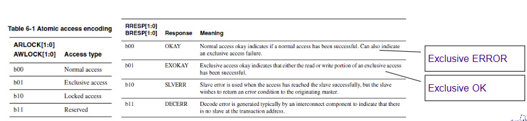

## Atomics instructions
- Examples of atomic operations
  - test and set
  - atomic increment
  - atomic exchange register and memory location
  - compare and swap
- Atomic increment case
  - simple approach

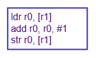

  - What happen when more than one try
    - "strex r0,r1,[addr]": 'r0' will have '0' when succeeded

## Atomic lock accesses
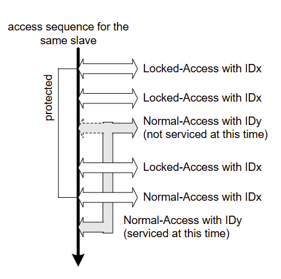

- When a master starts a locked sequence of either read or write transactions it must ensure that it has no other outstanding transactions waiting to complete. Any transaction with ARLOCK[1:0] or AWLOCK[1:0] set to indicate a locked sequence forces the interconnect to lock the following transaction. Therefor, a locked sequence must always complete with a final transaction that does not have ARLOCK[1:0] or AWLOCK[1:0] set to indicate a locked access. This final transaction is included in the locked sequence and effectively removes the lock.

## Atomic exclusive access
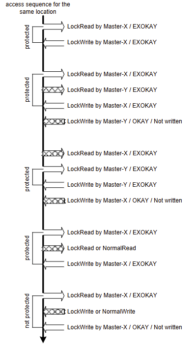

- The basic process for an exclusive access is:
  - A master performs an exclusive read from an address location
  - At some later time, the master attempts to complete the exclusive operation by performing an exclusive operation by performing an exclusive write to the same address location
  - The exclusive write access of the master is signaled as:
    - Successful if no other master has written to that location between the read and write accesses
    - Failed if another master has written to that location between the read and write accesses. In this case the address location is not updated. (OKAY)

## Cache support
- These signals provide additional information about how the transaction can be processed.
  - B([0], Bufferable), C([1], Cacheable), RA([2], Read Allocate), WA([3], Write Allocate)
  - ARCACHE[3:0]
  - AWCACHE[3:0]

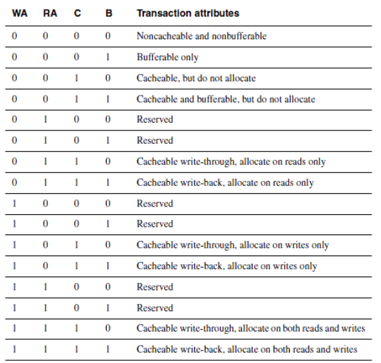

- Bufferable
  - Write delay can be an arbitrary one
- Cacheable -> Modifiable (AXI4)
  - Read: prefetch or reach cache is possible
  - Write: write merging is possible
- Read allocate
  - If read miss, fetch the data to cache
- Write allocate
  - If write miss, fetch the data to cache, and then write to the cache (and through the memory)
  
  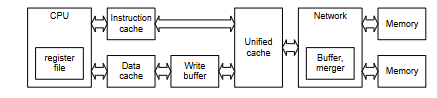

## Protection
- To support complex system designs, it is often necessary for both the interconnect and other devices in the system to provide protection against illegal transactions. The AWPROT or ARPROT signal gives three levels of access protection:

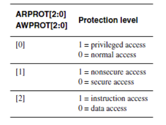

## Write address channel
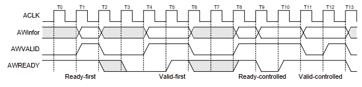

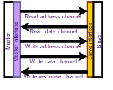

- The master can assert the AWVALID only when it drives valid information (i.e., address and control).
- The AWVALID and AWinfor must remain asserted until the salve accepts these (i.e, AWREADY is asserted)
- The AWREADY can be either high or low by default
  - But, high is recommended in order to reduce transfer latency
- Do not wait for AWREADY before asserting AWVALID in order to prevent a deadlock case.

## Write data channel
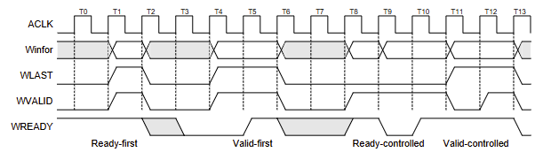

- The master can assert the WVALID only when it drives valid information (i.e, data and control)
- The WVALID and Winfor must remain asserted until the salve accepts these ( WREADY is asserted)
- The master must assert WLAST when it drives the final write 
- The WREADY can be either high or low by default
  - But, high is recommended in order to reduce transfer latency
- Do not wait for WREADY before asserting WVALID in order to prevent a deadlock case

## Write response channel
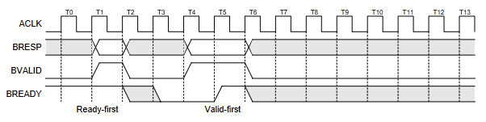

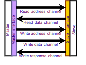

- The slave can assert the BVALID only when it drives a valid write response
- The BVALID must remain asserted until the master accepts the write response (BREADY is asserted)
- The BREADY can be either high or low by default
  - But, high is recommended in order to reduce transfer latency
- Do not wait for BREADY before asserting BVALID in order to prevent a deadlock case.

## All together for write
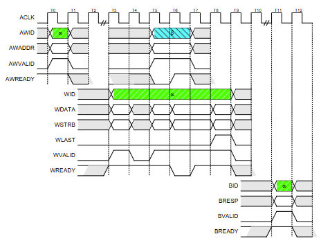

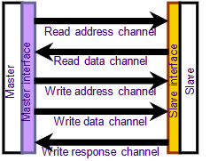

## Read address channel
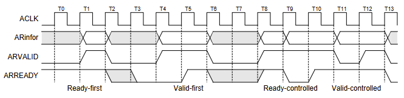

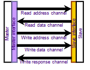

- The master can assert the ARVALID only when it drives valid information (address and control)
- The ARVALID and ARinfor must remain asserted until the slave accepts these (ARREADY is asserted)
- The ARREADY can be either high or low by default
  - But, high is recommended in order to reduce transfer latency
- Do not wait for ARREADY before asserting ARVALID in order to prevent a deadlock case.

## Read data channel
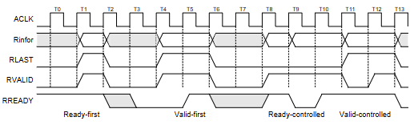

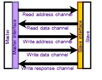

- The slave can assert the RVALID only when it drives valid information (data and control)
- The RVALID and Rinfor must remain asserted until the master accepts these (RREADY is asserted)
- The slave must assert RLAST when it drives the final write transfer in the burst.
- The RREADY can be either high or low by default
  - But, high is recommended in order to reduce transfer latency
- Do not wait for RREADY before asserting RVALID inorder to prevent a deadlock case

## All together for read
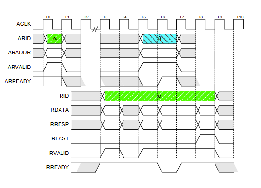

## Channel definition
- Read and write address channel
  - Variable-length bursts, 1 to 16 data transfers per burst
  - bursts with a transfer size of 9-1024 bits (1 to 128 bytes)
  - wrapping, incrementing, and non-incrementing bursts
  - atomic operations, using exlusive or locked accesses
  - system-level caching and buffering control
  - secure and privileged access
- Read data channel
  - data bus, can be 8, 16, 32, 64, 128, 256, 512, 1024 bits wide
  - a read response indicating the completion status of the read transaction
- Write data channel
  - the data bus, can be 8, 16, 32, 64, 128, 256, 512, 1024 bits wide
  - one byte lane strobe for every eight data bits
  - always treated as buffered, so that the master can perform write transactions without slave acknowledgement of previous write transactions
- Write response channel
  - all write transactions use completion signaling
  - the completing signal occurs once for each burst, not for each individual data transfer within the burst

## Channel dependency
- The slave should start read data sequence after the read address sequence
  - Read data must always follows the address to which the data related
- The master should start write address sequence before write data sequence
  - However, the write data can appear at the interface before the write address that related to it due to register stages of the write address
- The slave should start write response sequence after write data sequence
  - A write response must always follow the last write transfer in the write transaction to which the write response related
  - In addition, the AXI4 protocol requires that the write response for all transactions must not be given until the clock cycle after address acceptance

## Handshake dependency
- In order to avoid deadlock
  - The VALID signal must not be dependent on the READY signals
    - The VALID signal must not wait for any READY signal before driving it
  - The READY signal can wait for assertion of the VALID signal
- Guess what will happen
  - Master waits for READY before driving VALID for something
  - While, slave also waits for VALId before driving READY for something

- The slave can wait for ARVALID to be asserted before it assets ARREADY
  - meaning that ARREADY can be driven prior to ARVALID

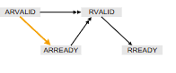

- The slave must wait for ARVALID and ARREADY to be asserted before it starts to return read data by asserting RVALID

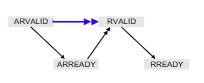

- The master can wait for RVALID to be asserted before it asserts RREADY
  - Meaning that RREADY can be driven prior to RVALID
  - The VALID signal must not wait for any READY signal before driving it

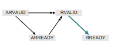

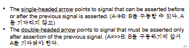

- The master must not wait for the slave to assert AWREADY or WREADY before asserting AWVALID or WVALID

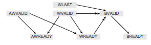

- The slave can wait for AWVALID or WVALID, or both, before AWREADY.
- The slave can wait for AWVALID or WVALID, or both, before asserting WREADY

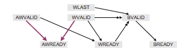

- The slave must wait for both WVALID and WREADY to be asserted before asserting BVALID

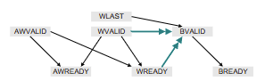

- In addition, the AXI4 protocol requires that the write response for all transactions must not be given until the clock cycle after address acceptance

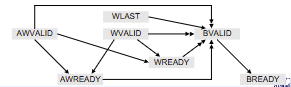

## Ordering
- Write request and data: The write data can appear at an interface before the write address that relates to it
- Read data must always follow the address to which the data relates
- A write response must always follow the last write transfer in the write transaction to which the write response relates
- The data for a sequence of read transaction with the same ARID value must be returned in order

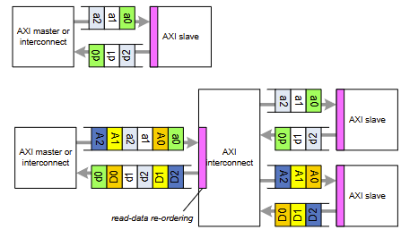

- Write data with different AWIDs follow their address order
- Responses to multiple writes with different IDs can be out-of-order from address order
- Write interleaving
  - Interleaving rule
    - Data with different ID can be interleaved
    - The order within a single burst is maintained
    - The order of first data needs to be the same with that of request
  - AXI4 does not support data interleaving
    - As a result, WID is not used
    - But, all data-for-write should follow the same order of address arriving

## Burst transfers
- AHB burst (locked)
  - Address and data are locked together
  - Single pipeline stage
  - HREADY controls intervals of address and data

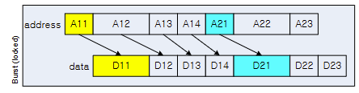

- AHB burst (slow slave)
  - If one slave is very slow, all data is held up

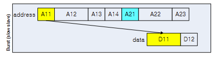

- AXI one address for burst
  - One address for entire burst

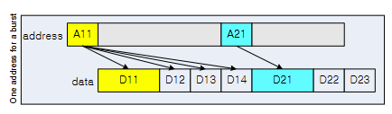

- AXI multiple outstanding bursts
  - One address for entire burst
  - Allows multiple outstanding addresses

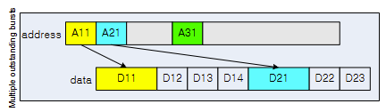

- AXI out-of-order completion
  - Each transaction has an ID attached
  - Transactions with the same ID must be ordered
  - Requires bus-level monitoring to ensure correct ordering on each ID
  - Masters can issue multiple ordered addresses
  - Fast slaves may return data ahead of slow slaves
  - Complex slaves may return data out of order

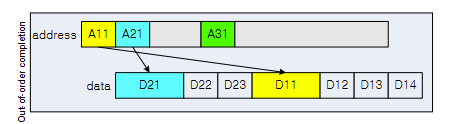

- AXI data interleaving
  - Returned data can enven be interleaved
  - Gives maximum use of data bus
  - Data within a burst is always in order

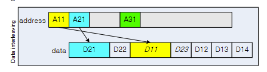

## Addressing options
- AXI is burst-based, all transaction can be seen as a burst that consists of a number of transfers
- The address of a burst is the address of the first byte in the transfer
  - The slave should calculate the address of subsequent transfers in the burst
- The burst address must not cross 4Kbyte boundary
  - Not allowed crossing boundaries between slaves
    - A burst is only destined for a single slave
- No early termination allowed
  - Master can disable further writes by de-asserting all the strobes of the remaining transfers
  - Master can discard futher reads, but the remaining transfers should be completed
    - Be careful to discard a read-sensitive devide such as a FIFO
  - Additional limitations for AXI4
    - Burst longer than 16 are only supported for the INCR burst type
      - WRAP & FIXED burst types can be up to 16 burst length
    - Exclusive access are not permitted to use a burst length greater than 16

## Transaction ordering
- For each channel, each information is tagged with transaction identification (ID tag) in order to find corresponding information
  - Multi-master system should use additional ID tag to ensure that ID from all masters are unique.
  - Multiple virtual masters can be possible by adopting sub-field tag ID
    - A port of master interface can act as a multiple master

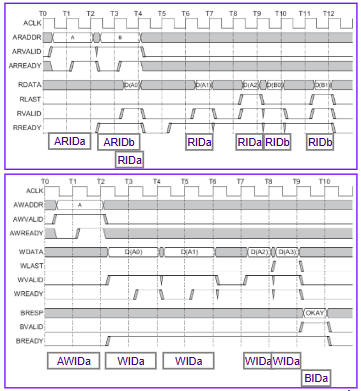 

